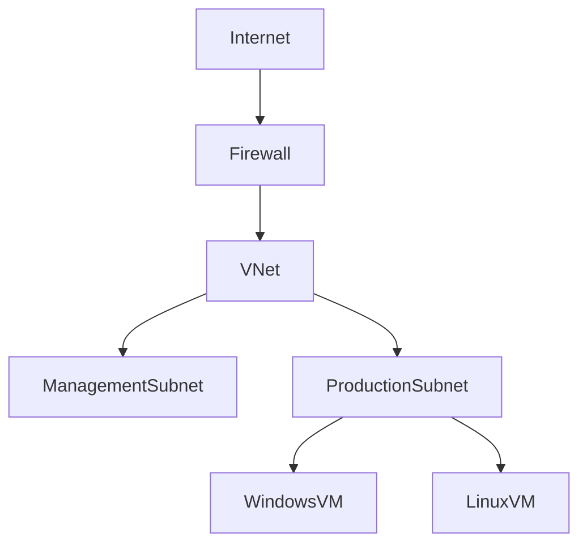

# cloud-security-lab
Personal Cloud Security Lab simulating a UK company.

Azure Security
Security Operations
Detection Engineering
Incident Response
Terraform
Automation

🖼️ Architecture Diagram  

